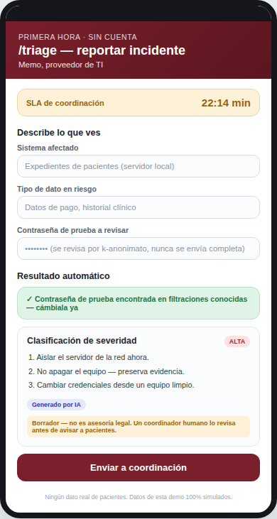
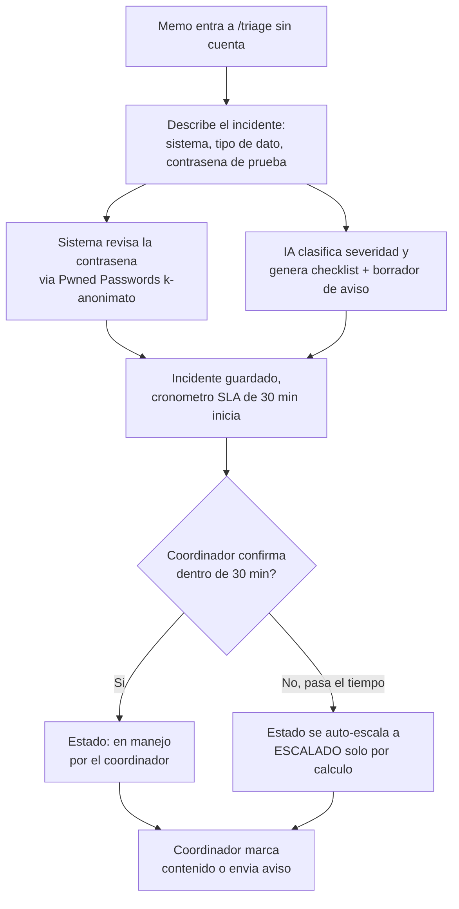
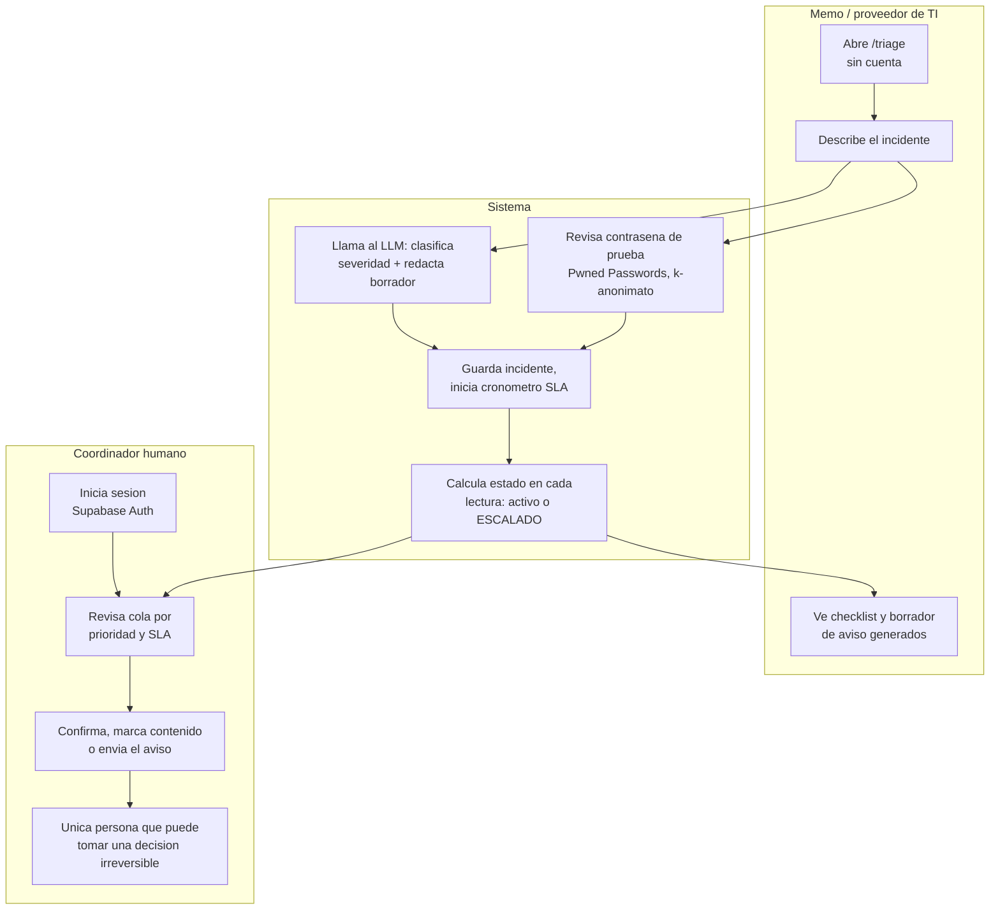

# PACKET — Primera Hora: triage de incidentes para el proveedor de TI que responde una brecha (w08)

Business Bending · Cristina Meouchi (OPERATOR) · Repair Flow, Crystal Ball Studio · Team 8

## Problema, en mis palabras

Cuando una pyme sufre una brecha, el caos no es técnico — es de coordinación. Mi Brief ya lo
estableció con evidencia: la LFPDPPP obliga a notificar a los afectados, pero ninguna ley
resuelve que el proveedor de TI de una clínica — que es quien detecta el problema primero,
antes que cualquier forense o abogado — no tenga protocolo, capacidad ni plantilla para actuar
en los primeros 30 minutos. El benchmark global (Coalition + el modelo "breach coach") ya existe,
pero está diseñado para empresas grandes con consejo de administración, no para un freelancer de
TI que atiende 3-4 clínicas. Esta pieza ataca exactamente esa ventana: la primera hora después
de que alguien detecta algo raro, no la investigación forense completa ni el envío legal de
notificaciones.

## Usuario exacto

Memo, 34 años, administra la infraestructura de TI de 3-4 clínicas y despachos pequeños en
CDMX como micro-empresa/freelance. No tiene formación formal en ciberseguridad ni un protocolo
escrito — hoy, ante un ransomware o un acceso raro, su plan es "buscar en Google y tratar de no
entrar en pánico mientras el cliente le marca sin parar". Mi pieza es exactamente lo que Memo
abre en el minuto en que ve algo raro: no la dueña de la clínica (ella es la usuaria final del
Brief, pero no toca el producto el día uno), no un forense certificado — Memo, en el peor
momento de su semana.

## Definición de éxito

Antes de que cierre el módulo: Memo entra a `/triage` sin necesidad de llamar a nadie primero,
describe lo que ve en un formulario corto y estructurado (qué sistema se vio afectado, qué tipo
de datos, si hay una contraseña de prueba sospechosa de estar expuesta). El sistema clasifica la
severidad con IA, genera una checklist de contención inmediata y un borrador de aviso a
pacientes — etiquetado siempre como "borrador generado por IA, no es asesoría legal" — y revisa
si la contraseña reportada aparece en bases de datos de contraseñas filtradas (vía Pwned
Passwords, por k-anonimato: nunca se envía la contraseña real, solo un prefijo de su hash).
Cada incidente arranca con un cronómetro de SLA de 30 minutos; si nadie de coordinación lo
confirma en esa ventana, se auto-escala a "ESCALADO" solo por cálculo de tiempo, sin ningún
proceso en segundo plano que pueda fallar. Un coordinador autenticado en `/panel` ve la cola
ordenada por prioridad y SLA, y es la única persona que puede marcar un incidente como contenido
o la notificación como enviada — el sistema clasifica y redacta borradores, nunca decide ni
envía nada por sí mismo.

## Mockup

Pantalla de `/triage` vista desde el celular de Memo: formulario de reporte arriba, clasificación
de severidad y checklist generadas por IA abajo, con la etiqueta de borrador siempre visible.

## El flujo

## El swimlane

## Benchmark

La mejor solución que existe hoy en el mundo para esto es el modelo del **"breach coach"** que
usan las aseguradoras cibernéticas en EUA/RU — Coalition lo empaqueta directamente con su
póliza para pymes a través de su propia afiliada, Coalition Incident Response. Mi pieza
**difiere y localiza** ese modelo en dos sentidos: lo bajo de escala y de precio para que lo
pueda activar un freelancer de TI de una clínica de 20 personas, no una empresa con consejo de
administración; y lo ato explícitamente al marco legal mexicano (LFPDPPP), no al marco de EUA/RU
en el que nació el modelo original. En México, el intento más cercano — PyMEs Ciberseguras
(lanzado julio 2026, AMITI + Mastercard + Secretaría de Economía) — es prevención y
autoevaluación, no respuesta: no manda a nadie a la primera hora de una brecha real, que es
justo el vacío que esta pieza ataca.

## La vista larga

Si esta pieza funciona, en 3 años se convierte en la capa de coordinación estándar entre
proveedores de TI independientes y un equipo real de respuesta a incidentes en México — el "911
de brechas" que hoy no existe para la pyme. El negocio deja de ser una herramienta de triage de
software y se convierte en la red de especialistas de respuesta que mi propio Brief identificó
como el punto débil real: capacidad. El valor ya no está solo en clasificar y redactar — está en
la garantía de que cuando seis clínicas llaman el mismo martes, alguien real contesta a tiempo.

## Scope cut

No construyo: un antivirus ni un forense digital real (eso lo hace una herramienta o persona
especializada después de esta primera hora — zona prohibida de la tarea, además); el envío
automático de notificaciones a pacientes (siempre lo revisa y envía un humano, nunca el
sistema); comunicación directa con autoridades (terreno legal, fuera de alcance); ni el equipo
real de dos especialistas + coordinador como personas contratadas — eso es el plan de negocio
del Blueprint de mi equipo, no esta pieza de software.

## Arquitectura + stack

| Capa | Herramienta | Por qué |
|---|---|---|
| Frontend + backend | Next.js 16 (App Router) + TypeScript + Tailwind 4 | Mismo stack verificado en w07, cero curva de aprendizaje nueva |
| Base de datos + auth | Supabase (Postgres, Auth, RLS) | Mismo patrón de cliente de servicio / cliente de sesión ya probado en producción |
| Hosting | Vercel | `vercel.json` fija `framework: nextjs` desde el primer commit — evita el bug de Framework Preset de la semana pasada |
| LLM (Dragon Stack) | Google Gemini API (modelo Flash, nivel gratuito) | Clasifica severidad y redacta el borrador de aviso — nunca decide ni envía nada |
| Seguridad (Dragon Stack) | Pwned Passwords API (k-anonimato, sin llave) | Revisa si una contraseña de prueba aparece en filtraciones conocidas, sin exponer la contraseña real |
| Automatización (Dragon Stack) | Cálculo de estado por tiempo (sin cron) | El SLA se evalúa en cada lectura, igual que `estaActivo` en w07 — una fuente menos de fallas |
| Validación | zod en cada formulario y ruta | Nada entra crudo a la base de datos ni al prompt del LLM |
| Datos de la demo | 100% simulados, etiquetados | Ningún dato real de pacientes, ninguna contraseña real |

## Plan de pruebas

1. Entrar a `/triage` sin cuenta → el formulario carga, sin pedir login.
2. Enviar un reporte de incidente completo → se guarda, aparece clasificación de severidad y
   checklist de contención generadas por IA, con la etiqueta de borrador visible.
3. Reportar con una contraseña de prueba conocida como filtrada (ej. `123456`) → el chequeo de
   Pwned Passwords la marca como comprometida.
4. Reportar con una contraseña de prueba aleatoria no filtrada → el chequeo la marca como no
   encontrada.
5. Forzar (en datos de prueba) que pase la ventana de 30 minutos → el estado cambia a
   "ESCALADO" solo por cálculo de tiempo, sin ninguna acción manual.
6. Entrar a `/panel` sin sesión → redirige a `/panel/login`.
7. Iniciar sesión correcta en `/panel` → se ve la cola de incidentes ordenada por prioridad y
   SLA, con opción de confirmar o marcar como contenido.
8. Confirmar que ninguna notificación a pacientes se envía sola — solo existe el botón de
   "marcar como enviada" que un coordinador humano acciona después de revisar el borrador.
9. Revisar el esquema completo → ningún campo guarda un dato real de paciente; todo lo que entra
   es texto de prueba etiquetado como simulado.
